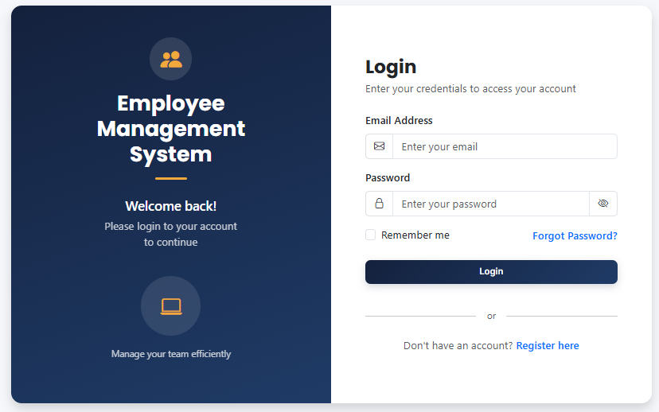
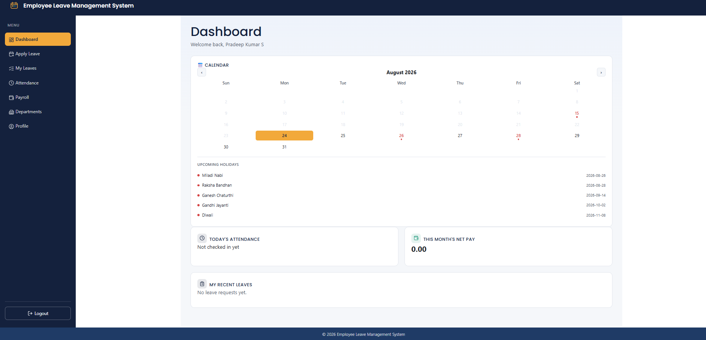
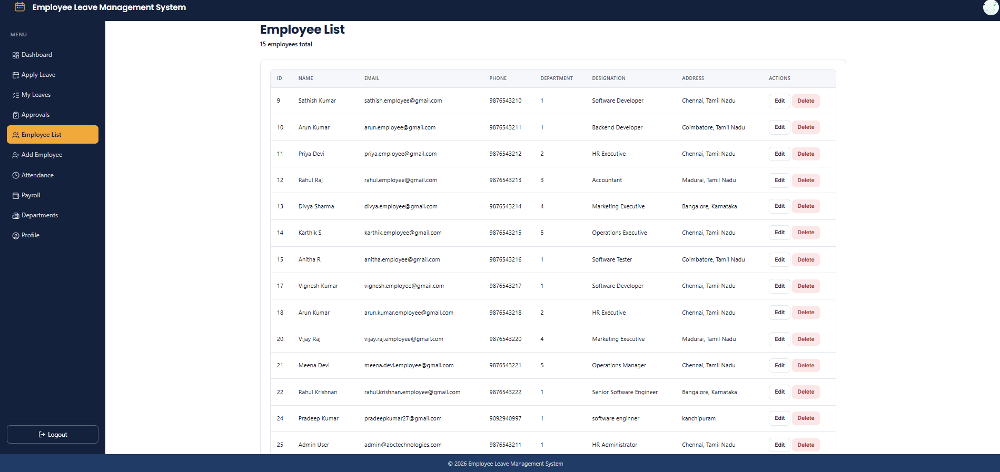
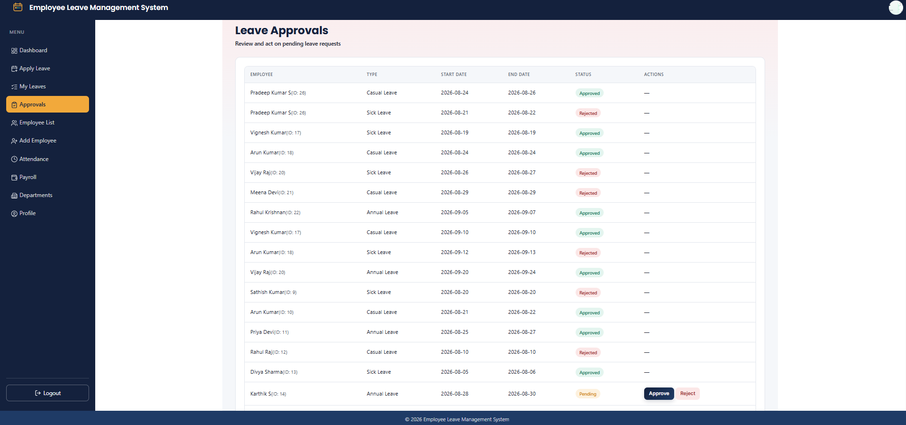
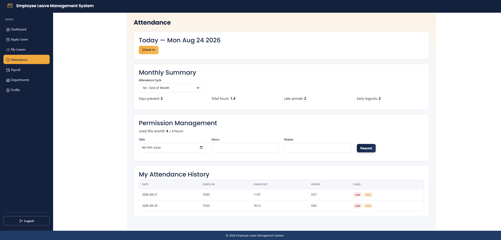
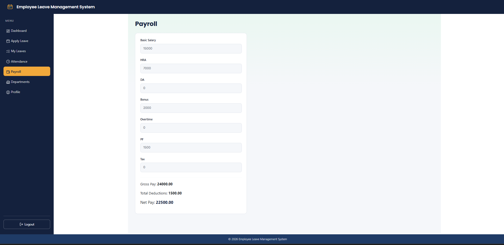
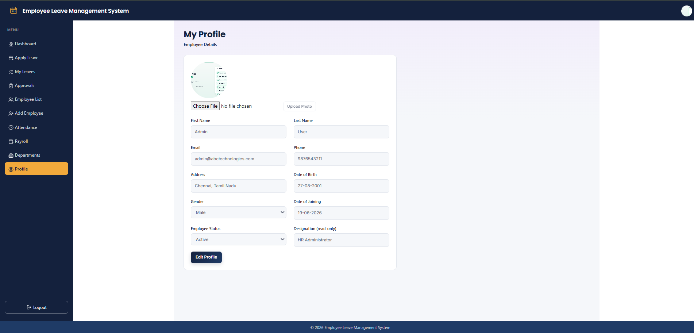

# Employee Leave Management System

A full-stack web application for managing employees, leave requests, attendance, and payroll — built as a team project.

## Team

- Frontend: [Pradeep Kumar, Monisha]
- Backend: [Deepika Sridaran, Rachel Arem]
- Database: [Sathish Kumar]

## Tech Stack

**Backend:** Python, Flask, Flask-SQLAlchemy, Flask-JWT-Extended, Flask-Bcrypt, Flask-CORS

**Database:** MySQL

**Frontend:** React (Vite), React Router, React Bootstrap, Lucide Icons

## Features

- **Authentication:** Register, Login (JWT-based), Forgot Password
- **Role-based access:** Admin and Employee roles with different permissions
- **Employee Management:** Add, edit, delete, and list employees (Admin only)
- **Department Management:** View departments and their employees
- **Leave Management:** Apply for leave, view leave history, admin approval/rejection with mandatory reasons, monthly leave limits
- **Attendance:** Daily check-in/check-out, monthly summaries, configurable pay cycles, late/early tracking, permission requests
- **Payroll:** Salary breakdown (Basic, HRA, DA, Bonus, Overtime, PF, Tax) with automatic net pay calculation
- **Profile:** Editable employee profile with photo upload
- **Dashboard:** Role-specific live overview — org-wide stats for Admin, personal summary for Employees
- **Interactive Calendar:** Government holidays, click-to-apply-leave shortcut

## Project Structure

Employee-management-system/
├── app.py # Flask application entry point
├── config.py # Configuration (DB, JWT, mail)
├── extensions.py # Flask extension instances
├── requirements.txt # Python dependencies
├── controllers/ # Business logic
├── models/ # SQLAlchemy database models
├── routes/ # API route definitions
├── uploads/ # Uploaded profile photos (gitignored)
├── src/ # React frontend source
│ ├── pages/ # Page components
│ ├── components/ # Reusable UI components
│ ├── layouts/ # Layout wrapper (Navbar, Sidebar, Footer)
│ ├── services/ # API call functions
│ ├── data/ # Local mock data stores (Attendance, Payroll)
│ └── styles/ # Shared CSS
├── package.json # Frontend dependencies
└── [database dump].sql # Database schema + seed data

## Setup Instructions

### Prerequisites
- Python 3.10+
- Node.js 18+
- MySQL Server 8.0+

### Backend Setup
1. Create a virtual environment and activate it:

python -m venv venv
venv\Scripts\activate

2. Install dependencies:

pip install -r requirements.txt

3. Create a `.env` file (see `.env.example`) with your MySQL credentials.
4. Create the database and import the schema:
   - Open MySQL Workbench, create a database named `employee_management`
   - Run the provided `.sql` file to create tables and seed data
5. Start the backend:

python app.py

   Runs at `http://127.0.0.1:5000`

### Frontend Setup
1. Install dependencies:

npm install

2. Start the dev server:

npm run dev

   Runs at `http://localhost:5173`

## Demo Credentials

|   Role      | Email             | Password |
|---|---|---------|--------------------|
| Admin | admin@abctechnologies.com | Admin@123 |
| Employee | tsppradeepkumar@gmail.com | Pradeep@27 |

## Known Limitations

- Attendance and Payroll modules currently store data in browser localStorage as a frontend prototype, pending final backend integration for those two features.
- Profile fields (Date of Birth, Gender, Date of Joining) also use localStorage pending full backend wiring.

## Screenshots

, , , , , , 
